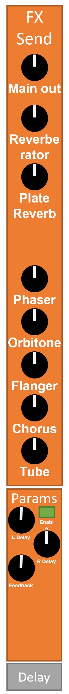

# Mixing Console & Audio Effect

On multi-core devices, MiniDexed can now be equiped with a complex and versatile mixing console that is composed of a multi-FX processor.

After the volume and pan controls, it is possible to set the send level of each Tone Generator to the individual Audio Effect and Main output. Below is the TG channel strip:

Each FX has the possibility to return to any other Audio FX unit as well as Main Output.

The diagram below shows the synopsis of this Mixing Console.

## The Audio FX

The following audio FX are available:

* **Tube:** an amplifier that mimmic the response of valve based amplifier.

  
  
  * ***Enable [Off - On]:*** Enable / disable the FX unit.
  * ***Overdrive [0 - 99]:*** the overdrive amount the more the overdrive the less linear is the amplification. Below is the amplifier response based on different value of the overdrive: 

 
 

* **Chorus:** this effect is an audio signal processing technique that creates a richer, thicker sound by duplicating the original signal and slightly delaying and modulating the duplicated signal in pitch and time. The modulated and delayed signals are then mixed back together with the original signal, creating a sound that seems to be coming from multiple sources or voices.
The result of a chorus effect is a distinctive "shimmering" or "swirling" sound, similar to the sound of a choir or a group of instruments playing together. Chorus effects are commonly used in music production to add depth and complexity to a sound, particularly for guitars, keyboards, and vocals. They are also used in some audio equipment, such as guitar pedals and synthesizers, to produce a chorus effect in real-time.
This implementation is a standard Chorus FX that is based on 4 LFO:
    | LFO | Min. freq. | Max. freq. | Phase |
    |-----|------------|------------|-------|
    |   1 |     0.0 Hz |    0.25 Hz |    0° |
    |   2 |     0.0 Hz |    0.25 Hz |   90° |
    |   3 |     0.0 Hz |    0.35 Hz |    0° |
    |   4 |     0.0 Hz |    0.35 Hz |   90° |

  

  * ***Enable [Off - On]:*** Enable / disable the FX unit.
  * ***Rate [0 - 99]:*** modulate the LFO rate between thei minimum frequency (Rate = 0) and their maximum frequency (Rate = 99).
  * ***Depth [0 - 99]:*** the level of modulation of the FX. The higher the value the more prononced the audio processing is.

 
 

* **Flanger:** this effect is an audio signal processing technique that creates a sweeping, swirling sound by mixing a delayed copy of an audio signal with the original signal. The delay time of the copied signal is varied over time, creating a series of peaks and troughs in the frequency spectrum of the combined signal.
The resulting sound is similar to a chorus effect, but with a more pronounced "swooshing" or "jet engine" effect, as the peaks and troughs of the frequency spectrum sweep up and down in a cyclic pattern. Flangers are often used in music production to create an "otherworldly" or psychedelic effect, particularly on guitars and keyboards.
The name "flanger" comes from the original method of creating the effect, which involved using two tape recorders to play back the same signal simultaneously, while a finger was used to slightly slow down or speed up the flange (rim) of one of the reels, causing the delayed signal to vary in time. Today, flanger effects are typically created digitally, using specialized signal processing algorithms in software or hardware devices such as guitar pedals or studio processors.
This implementation is based on 2 LFO:
    | LFO | Min. freq. | Max. freq. | Phase |
    |-----|------------|------------|-------|
    |   1 |     0.1 Hz |     5.0 Hz |    0° |
    |   2 |     0.1 Hz |     5.0 Hz |   90° |

  

  * ***Enable [Off - On]:*** Enable / disable the FX unit.
  * ***Rate [0 - 99]:*** modulate the LFO rate between thei minimum frequency (Rate = 0) and their maximum frequency (Rate = 99).
  * ***Depth [0 - 99]:*** the level of modulation of the FX. The higher the value the more prononced the audio processing is.
  * ***Feedback [0 - 99]:*** the amount of of processed signal that is re-injected at the audio effect input.

 
 

* ***Orbitone:*** this is an ensemble effect that is an audio signal processing technique that creates the impression of multiple instruments or voices playing together. It is similar to a chorus effect in that it involves duplicating and modulating an audio signal, but with some differences in the way it is applied.
In an ensemble effect, the duplicated signals are modulated with a low-frequency oscillator (LFO) that varies the pitch and amplitude of the signals over time. The modulated signals are then mixed with the original signal, creating a sound that is thicker and richer, as if several instruments or voices were playing in unison.
The resulting sound can be used to add depth and character to a musical performance, particularly for string, brass, or vocal sounds. Ensemble effects are often used in music production to create a sense of warmth, depth, and movement in a mix.
This implementation is based on 4 LFO:
    | LFO | Min. freq. | Max. freq. | Phase |
    |-----|------------|------------|-------|
    |   1 |     0.0 Hz |     1.0 Hz |    0° |
    |   2 |     0.0 Hz |     1.0 Hz |  120° |
    |   3 |     0.0 Hz |     1.0 Hz |  240° |
    |   4 |     0.0 Hz |     8.8 Hz |    0° |
    |   5 |     0.0 Hz |     8.8 Hz |  120° |
    |   6 |     0.0 Hz |     8.8 Hz |  240° |

  

  * ***Enable [Off - On]:*** Enable / disable the FX unit.
  * ***Rate [0 - 99]:*** modulate the LFO rate between thei minimum frequency (Rate = 0) and their maximum frequency (Rate = 99).
  * ***Depth [0 - 99]:*** the level of modulation of the FX. The higher the value the more prononced the audio processing is.
  * ***Feedback [0 - 99]:*** the amount of of processed signal that is re-injected at the audio effect input.

 
 

* ***Phaser:*** a phaser or phase shifter effect is an audio signal processing technique that creates a sweeping, "whooshing" sound by altering the phase relationship between two identical signals. This is achieved by splitting the audio signal into two parts, delaying one of them slightly, and then combining them again. The delay time is varied over time, causing certain frequencies in the audio signal to be boosted and others to be attenuated.
The resulting sound is characterized by a series of peaks and troughs in the frequency spectrum, which move up and down in a sweeping pattern. The phaser effect is often used in music production to create a sense of movement and space in a mix, and is particularly effective on guitars, keyboards, and other melodic instruments.
This implementation is based on 2 LFO:
    | LFO | Min. freq. | Max. freq. | Phase |
    |-----|------------|------------|-------|
    |   1 |     0.0 Hz |     2.5 Hz |    0° |
    |   2 |     0.0 Hz |     2.5 Hz |   90° |

  

  * ***Enable [Off - On]:*** Enable / disable the FX unit.
  * ***Rate [0 - 99]:*** modulate the LFO rate between thei minimum frequency (Rate = 0) and their maximum frequency (Rate = 99).
  * ***Depth [0 - 99]:*** the level of modulation of the FX. The higher the value the more prononced the audio processing is.
  * ***Feedback [0 - 99]:*** the amount of of processed signal that is re-injected at the audio effect input.
  * ***Nb Stages [2 - 24]:*** The number of state variable filter stages that the audio signal will traverse.

 
 

* **Delay:** the is an audio signal processing technique that creates a repeated, delayed version of an original sound. It does this by temporarily storing a copy of the original audio signal in a buffer, and then playing it back at a later time.
The delay time can be set to vary from a few milliseconds to 1 second, and the repeated sound can be manipulated in various ways to create a range of different effects.
Delay effects are used in a wide variety of musical genres to add texture, depth, and interest to a mix. They can be used on almost any sound source, including vocals, guitars, keyboards, drums and other melodic instruments.
The implemention of this delay accept negative values for both left and right delay. Negative values will echo sound reversed.

  

  * ***Enable [Off - On]:*** Enable / disable the FX unit.
  * **Left Delay [-99 - 99]:** the left delay from 0 to 2 seconds.
  * **Right Delay [-99 - 99]:** the left delay from 0 to 2 seconds.
  * ***Feedback [0 - 99]:*** the amount of of processed signal that is re-injected at the audio effect input.

 
 

* **Plate Reverb:** A plate reverb effect is an audio signal processing technique that simulates the sound of a large, metallic plate vibrating in response to an audio signal. It is one of the most iconic and widely used types of artificial reverberation in music production.
The plate reverb effect is created by passing an audio signal through a transducer that causes a large metal plate to vibrate in response. The vibrations of the plate are then picked up by one or more microphones and mixed back with the original signal. The sound of the plate reverb is characterized by a smooth decay and a diffuse, ambient quality that can add warmth and depth to a mix.
Plate reverb effects are often used in music production to add space, depth, and character to a mix. They are particularly effective on vocals, drums, and other percussive sounds, and can be used to create a sense of space and distance in a recording. The effect can be adjusted to achieve varying degrees of intensity, decay time, and other parameters.

  

  * ***Enable [Off - On]:*** Enable / disable the FX unit.
  * ***Size [0 - 99]:*** the size of the simulated metallic plate hence of the room.
  * ***High Damping [0 - 99]:*** the amount of high-frequency attenuation or absorption applied to the plate's vibrations. It is a key parameter that can have a significant impact on the overall sound of the plate reverb effect.
  * ***Low Damping [0 - 99]:*** the amount of low-frequency attenuation or absorption applied to the plate's vibrations. It is a key parameter that can have a significant impact on the overall sound of the plate reverb effect.
  * ***Low Pass [0 - 99]:*** the low pass parameter of a plate reverb refers to a filter that is applied to the reverb signal to attenuate or cut off frequencies above a certain threshold.
  A low pass filter can be used to create a darker, more mellow sound by reducing or removing high-frequency content from the reverb effect. This can be useful when trying to create a more vintage or retro sound, or when trying to soften harsh or bright sounds in a mix.
  * ***Diffusion [0 - 99]:*** the diffusion parameter of a plate reverb refers to the degree to which the reflections in the reverb decay are dispersed or spread out in time and space. It determines how "dense" or "sparse" the reverb effect sounds and how the individual reflections blend together.
  A higher diffusion parameter means that the reflections in the reverb decay will be more widely dispersed, resulting in a more "washed out" or diffuse sound. This can be useful when trying to create a sense of space or depth in a mix, or when trying to create a more ambient or atmospheric effect.
  Conversely, a lower diffusion parameter means that the reflections in the reverb decay will be more closely spaced, resulting in a more defined and focused sound. This can be useful when trying to create a more natural-sounding reverb effect, or when trying to highlight the details of a particular instrument or sound in a mix.
  * ***Level [0 - 99]:*** the level parameter of a plate reverb refers to the overall level or amplitude of the reverb effect. It determines how loud the reverb signal is in relation to the dry or unprocessed signal.

 
 

* **Reverberator:** the reverberator effect, commonly known as reverb, is an audio processing effect that simulates the sound reflections and acoustic environment of a physical space.
When a sound is produced in a physical space, it travels through the air and reflects off the walls, floors, and other surfaces in the environment. These reflections create a sense of space and depth, and contribute to the character and quality of the sound.
A reverberator effect works by simulating these reflections, and can be used to create a wide range of sonic environments, from small and intimate spaces like a bedroom or bathroom, to large and expansive spaces like a concert hall or cathedral.
Reverberator can be applied to individual tracks or to a mix, and can be adjusted in various ways, such as changing the decay time or "size" of the simulated space, adjusting the frequency content of the reverb, and adjusting the level or balance of the reverb effect in relation to the dry or unprocessed signal.
Reverberator is a common effect used in many genres of music, as well as in film, television, and other forms of audio production. It can be used to create a sense of realism, depth, and immersion, or to add a sense of ambiance, texture, or mood to a recording or production.
This implementation pushes the reverberation to reach almost the shimmer effect.

  

  * ***Enable [Off - On]:*** Enable / disable the FX unit.
  * **Gain [0 - 99]:** the gain parameter of the reverberator refers to the overall level or amplitude of the reverberator effect. It determines how loud the reverberator signal is in relation to the dry or unprocessed signal.
  * **Time [0 - 99]:** the time determines the size of the simulated reverberating space.
  * **Diffusion [0 - 99]:** the diffusion parameter of a reverberator refers to the degree to which the reflections in the reverb decay are dispersed or spread out in time and space. It determines how "dense" or "sparse" the reverberator effect sounds and how the individual reflections blend together.
  A higher diffusion parameter means that the reflections in the reverb decay will be more widely dispersed, resulting in a more "washed out" or diffuse sound. This can be useful when trying to create a sense of space or depth in a mix, or when trying to create a more ambient or atmospheric effect.
  Conversely, a lower diffusion parameter means that the reflections in the reverberator decay will be more closely spaced, resulting in a more defined and focused sound. This can be useful when trying to create a more natural-sounding reverberator effect, or when trying to highlight the details of a particular instrument or sound in a mix.
  * **Low Pass [0 - 99]:** the low pass parameter of a plate reverb refers to a filter that is applied to the reverb signal to attenuate or cut off frequencies above a certain threshold.
  A low pass filter can be used to create a darker, more mellow sound by reducing or removing high-frequency content from the reverb effect. This can be useful when trying to create a more vintage or retro sound, or when trying to soften harsh or bright sounds in a mix.

## The Menu structure

* *MiniDexed*
  * *TG1*
    * *Voice*
    * *Bank*
    * *Volume*
    * *Pan*
    * **FX-Send**
      * **> Tub**  *[0 - 99]*: the amount of the Tone Generator signal that will be send to the Tube FX Unit.
      * **> ChR**  *[0 - 99]*: the amount of the Tone Generator signal that will be send to the Chorus FX Unit.
      * **> Flg**  *[0 - 99]*: the amount of the Tone Generator signal that will be send to the Flanger FX Unit.
      * **> Orb**  *[0 - 99]*: the amount of the Tone Generator signal that will be send to the Orbitone FX Unit.
      * **> PhR**  *[0 - 99]*: the amount of the Tone Generator signal that will be send to the Phaser FX Unit.
      * **> Dly**  *[0 - 99]*: the amount of the Tone Generator signal that will be send to the Delay FX Unit.
      * **> Plt**  *[0 - 99]*: the amount of the Tone Generator signal that will be send to the Plate Reverb FX Unit.
      * **> Rev**  *[0 - 99]*: the amount of the Tone Generator signal that will be send to the Reverberator FX Unit.
      * **> Main** *[0 - 99]*: the amount of the Tone Generator signal that will be send to the Main output hence dry.
    * *Detune*
    * *Cutoff*
    * *Resonance*
    * *Pitch Bend*
    * *Portamento*
    * *Poly/Mono*
    * *Modulation*
    * *Channel*
    * *Edit Voice:*
      * ...
  * *TG2*
    * ... *similar to TG1 sub-menu* ...
  * *TG3*
    * ... *similar to TG1 sub-menu* ...
  * *TG4*
    * ... *similar to TG1 sub-menu* ...
  * *TG5*
    * ... *similar to TG1 sub-menu* ...
  * *TG6*
    * ... *similar to TG1 sub-menu* ...
  * *TG7*
    * ... *similar to TG1 sub-menu* ...
  * *TG8*
    * ... *similar to TG1 sub-menu* ...
  * **Effects**
    * Compress *[on - off]*: Enable / disable the FX unit for all Tone Generators.
    * **Tube**
      * **Enable** *[on - off]*: Enable / disable the FX unit.
      * **Overdrv** *[0 - 99]*: The overdrive amount of the FX unit.
      * **Levels**
        * **TG1 >** *[0 - 99]* - shortcut to [TG1] >> [FX-Send] >> [> Tub]
        * **TG2 >** *[0 - 99]* - shortcut to [TG2] >> [FX-Send] >> [> Tub]
        * **TG3 >** *[0 - 99]* - shortcut to [TG3] >> [FX-Send] >> [> Tub]
        * **TG4 >** *[0 - 99]* - shortcut to [TG4] >> [FX-Send] >> [> Tub]
        * **TG5 >** *[0 - 99]* - shortcut to [TG5] >> [FX-Send] >> [> Tub]
        * **TG6 >** *[0 - 99]* - shortcut to [TG6] >> [FX-Send] >> [> Tub]
        * **TG7 >** *[0 - 99]* - shortcut to [TG7] >> [FX-Send] >> [> Tub]
        * **TG8 >** *[0 - 99]* - shortcut to [TG8] >> [FX-Send] >> [> Tub]
        * **ChR >** *[0 - 99]* - shortcut to [Effects] >> [Chorus]  >> [> Tub]
        * **Flg >** *[0 - 99]* - shortcut to [Effects] >> [FlangR]  >> [> Tub]
        * **Orb >** *[0 - 99]* - shortcut to [Effects] >> [Orb]     >> [> Tub]
        * **PhR >** *[0 - 99]* - shortcut to [Effects] >> [PhasR]   >> [> Tub]
        * **Dly >** *[0 - 99]* - shortcut to [Effects] >> [Delay]   >> [> Tub]
        * **Plt >** *[0 - 99]* - shortcut to [Effects] >> [Plt Rvb] >> [> Tub]
        * **Rev >** *[0 - 99]* - shortcut to [Effects] >> [Rvbrtor] >> [> Tub]
      * **FX-Send**
        * **> ChR**  *[0 - 99]*: The amount of signal processed by the Tube FX unit that will be sent to the Chorus FX unit.
        * **> Flg**  *[0 - 99]*: The amount of signal processed by the Tube FX unit that will be sent to the Flanger FX unit.
        * **> Orb**  *[0 - 99]*: The amount of signal processed by the Tube FX unit that will be sent to the Orbitone FX unit.
        * **> PhR**  *[0 - 99]*: The amount of signal processed by the Tube FX unit that will be sent to the Phaser FX unit.
        * **> Dly**  *[0 - 99]*: The amount of signal processed by the Tube FX unit that will be sent to the Delay FX unit.
        * **> Plt**  *[0 - 99]*: The amount of signal processed by the Tube FX unit that will be sent to the Plate Reverb FX unit.
        * **> Rev**  *[0 - 99]*: The amount of signal processed by the Tube FX unit that will be sent to the Reverberator FX unit.
        * **> Main** *[0 - 99]*: The amount of signal processed by the Tube FX unit that will be sent to the Main output.
    * **Chorus**
      * **Enable** *[on - off]*: Enable / disable the FX unit.
      * **Rate**   *[0 - 99]*: The speed of the LFO of the FX unit.
      * **Depth**  *[0 - 99]*: The amount of effect that is applied to the input signal.
      * **Levels**
        * **TG1 >** *[0 - 99]* - shortcut to [TG1] >> [FX-Send] >> [> ChR]
        * **TG2 >** *[0 - 99]* - shortcut to [TG2] >> [FX-Send] >> [> ChR]
        * **TG3 >** *[0 - 99]* - shortcut to [TG3] >> [FX-Send] >> [> ChR]
        * **TG4 >** *[0 - 99]* - shortcut to [TG4] >> [FX-Send] >> [> ChR]
        * **TG5 >** *[0 - 99]* - shortcut to [TG5] >> [FX-Send] >> [> ChR]
        * **TG6 >** *[0 - 99]* - shortcut to [TG6] >> [FX-Send] >> [> ChR]
        * **TG7 >** *[0 - 99]* - shortcut to [TG7] >> [FX-Send] >> [> ChR]
        * **TG8 >** *[0 - 99]* - shortcut to [TG8] >> [FX-Send] >> [> ChR]
        * **Tub >** *[0 - 99]* - shortcut to [Effects] >> [Tube] >> [> ChR]
        * **Flg >** *[0 - 99]* - shortcut to [Effects] >> [FlangR] >> [> ChR]
        * **Orb >** *[0 - 99]* - shortcut to [Effects] >> [Orb] >> [> ChR]
        * **PhR >** *[0 - 99]* - shortcut to [Effects] >> [PhasR] >> [> ChR]
        * **Dly >** *[0 - 99]* - shortcut to [Effects] >> [Delay] >> [> ChR]
        * **Plt >** *[0 - 99]* - shortcut to [Effects] >> [Plt Rvb] >> [> ChR]
        * **Rev >** *[0 - 99]* - shortcut to [Effects] >> [Rvbrtor] >> [> ChR]
      * **FX-Send**
        * **> Tub**  *[0 - 99]*: The amount of signal processed by the Chorus FX unit that will be sent to the Tube FX unit.
        * **> Flg**  *[0 - 99]*: The amount of signal processed by the Chorus FX unit that will be sent to the Flanger FX unit.
        * **> Orb**  *[0 - 99]*: The amount of signal processed by the Chorus FX unit that will be sent to the Orbitone FX unit.
        * **> PhR**  *[0 - 99]*: The amount of signal processed by the Chorus FX unit that will be sent to the Phaser FX unit.
        * **> Dly**  *[0 - 99]*: The amount of signal processed by the Chorus FX unit that will be sent to the Delay FX unit.
        * **> Plt**  *[0 - 99]*: The amount of signal processed by the Chorus FX unit that will be sent to the Plate Reverb FX unit.
        * **> Rev**  *[0 - 99]*: The amount of signal processed by the Chorus FX unit that will be sent to the Reverberator FX unit.
        * **> Main** *[0 - 99]*: The amount of signal processed by the Chorus FX unit that will be sent to the Main output.
    * **FlangR**
      * **Enable**  *[on - off]*: Enable / disable the FX unit.
      * **Rate**    *[0 - 99]*: The speed of the LFO of the FX unit.
      * **Depth**   *[0 - 99]*: The amount of effect that is applied to the input signal.
      * **Feedbck** *[0 - 99]*: The amount of processed signal that will be reinjected at the input.
      * **Levels**
        * **TG1 >** *[0 - 99]* - shortcut to [TG1] >> [FX-Send] >> [> Flg]
        * **TG2 >** *[0 - 99]* - shortcut to [TG2] >> [FX-Send] >> [> Flg]
        * **TG3 >** *[0 - 99]* - shortcut to [TG3] >> [FX-Send] >> [> Flg]
        * **TG4 >** *[0 - 99]* - shortcut to [TG4] >> [FX-Send] >> [> Flg]
        * **TG5 >** *[0 - 99]* - shortcut to [TG5] >> [FX-Send] >> [> Flg]
        * **TG6 >** *[0 - 99]* - shortcut to [TG6] >> [FX-Send] >> [> Flg]
        * **TG7 >** *[0 - 99]* - shortcut to [TG7] >> [FX-Send] >> [> Flg]
        * **TG8 >** *[0 - 99]* - shortcut to [TG8] >> [FX-Send] >> [> Flg]
        * **Tub >** *[0 - 99]* - shortcut to [Effects] >> [Tube] >> [> Flg]
        * **ChR >** *[0 - 99]* - shortcut to [Effects] >> [Chorus] >> [> Flg]
        * **Orb >** *[0 - 99]* - shortcut to [Effects] >> [Orb] >> [> Flg]
        * **PhR >** *[0 - 99]* - shortcut to [Effects] >> [PhasR] >> [> Flg]
        * **Dly >** *[0 - 99]* - shortcut to [Effects] >> [Delay] >> [> Flg]
        * **Plt >** *[0 - 99]* - shortcut to [Effects] >> [Plt Rvb] >> [> Flg]
        * **Rev >** *[0 - 99]* - shortcut to [Effects] >> [Rvbrtor] >> [> Flg]
      * **FX-Send**
        * **> Tub**  *[0 - 99]*: The amount of signal processed by the Flanger FX unit that will be sent to the Tube FX unit.
        * **> ChR**  *[0 - 99]*: The amount of signal processed by the Flanger FX unit that will be sent to the Chorus FX unit.
        * **> Orb**  *[0 - 99]*: The amount of signal processed by the Flanger FX unit that will be sent to the Orbitone FX unit.
        * **> PhR**  *[0 - 99]*: The amount of signal processed by the Flanger FX unit that will be sent to the Phaser FX unit.
        * **> Dly**  *[0 - 99]*: The amount of signal processed by the Flanger FX unit that will be sent to the Delay FX unit.
        * **> Plt**  *[0 - 99]*: The amount of signal processed by the Flanger FX unit that will be sent to the Plate Reverb FX unit.
        * **> Rev**  *[0 - 99]*: The amount of signal processed by the Flanger FX unit that will be sent to the Reverberator FX unit.
        * **> Main** *[0 - 99]*: The amount of signal processed by the Flanger FX unit that will be sent to the Main output.
    * **Orb**
      * **Enable** *[on - off]*: Enable / disable the FX unit.
      * **Rate**   *[0 - 99]*: The speed of the LFO of the FX unit.
      * **Depth**  *[0 - 99]*: The amount of effect that is applied to the input signal.
      * **Levels**
        * **TG1 >** *[0 - 99]* - shortcut to [TG1] >> [FX-Send] >> [> Orb]
        * **TG2 >** *[0 - 99]* - shortcut to [TG2] >> [FX-Send] >> [> Orb]
        * **TG3 >** *[0 - 99]* - shortcut to [TG3] >> [FX-Send] >> [> Orb]
        * **TG4 >** *[0 - 99]* - shortcut to [TG4] >> [FX-Send] >> [> Orb]
        * **TG5 >** *[0 - 99]* - shortcut to [TG5] >> [FX-Send] >> [> Orb]
        * **TG6 >** *[0 - 99]* - shortcut to [TG6] >> [FX-Send] >> [> Orb]
        * **TG7 >** *[0 - 99]* - shortcut to [TG7] >> [FX-Send] >> [> Orb]
        * **TG8 >** *[0 - 99]* - shortcut to [TG8] >> [FX-Send] >> [> Orb]
        * **Tub >** *[0 - 99]* - shortcut to [Effects] >> [Tube] >> [> Orb]
        * **ChR >** *[0 - 99]* - shortcut to [Effects] >> [Chorus] >> [> Orb]
        * **Flg >** *[0 - 99]* - shortcut to [Effects] >> [FlangR] >> [> Orb]
        * **PhR >** *[0 - 99]* - shortcut to [Effects] >> [PhasR] >> [> Orb]
        * **Dly >** *[0 - 99]* - shortcut to [Effects] >> [Delay] >> [> Orb]
        * **Plt >** *[0 - 99]* - shortcut to [Effects] >> [Plt Rvb] >> [> Orb]
        * **Rev >** *[0 - 99]* - shortcut to [Effects] >> [Rvbrtor] >> [> Orb]
      * **FX-Send**
        * **> Tub**  *[0 - 99]*: The amount of signal processed by the Orbitone FX unit that will be sent to the Tube FX unit.
        * **> ChR**  *[0 - 99]*: The amount of signal processed by the Orbitone FX unit that will be sent to the Chorus FX unit.
        * **> Flg**  *[0 - 99]*: The amount of signal processed by the Orbitone FX unit that will be sent to the Flanger FX unit.
        * **> PhR**  *[0 - 99]*: The amount of signal processed by the Orbitone FX unit that will be sent to the Phaser FX unit.
        * **> Dly**  *[0 - 99]*: The amount of signal processed by the Orbitone FX unit that will be sent to the Delay FX unit.
        * **> Plt**  *[0 - 99]*: The amount of signal processed by the Orbitone FX unit that will be sent to the Plate Reverb FX unit.
        * **> Rev**  *[0 - 99]*: The amount of signal processed by the Orbitone FX unit that will be sent to the Reverberator FX unit.
        * **> Main** *[0 - 99]*: The amount of signal processed by the Orbitone FX unit that will be sent to the Main output.
    * **PhasR**
      * **Enable**  *[on - off]*: Enable / disable the FX unit.
      * **Rate**    *[0 - 99]*: The speed of the LFO of the FX unit.
      * **Depth**   *[0 - 99]*: The amount of effect that is applied to the input signal.
      * **Feedbck** *[0 - 99]*: The amount of processed signal that will be reinjected at the input.
      * **Stages**  *[2 - 24]*: The number of processing phasing stages.
      * **Levels**
        * **TG1 >** *[0 - 99]* - shortcut to [TG1] >> [FX-Send] >> [> PhR]
        * **TG2 >** *[0 - 99]* - shortcut to [TG2] >> [FX-Send] >> [> PhR]
        * **TG3 >** *[0 - 99]* - shortcut to [TG3] >> [FX-Send] >> [> PhR]
        * **TG4 >** *[0 - 99]* - shortcut to [TG4] >> [FX-Send] >> [> PhR]
        * **TG5 >** *[0 - 99]* - shortcut to [TG5] >> [FX-Send] >> [> PhR]
        * **TG6 >** *[0 - 99]* - shortcut to [TG6] >> [FX-Send] >> [> PhR]
        * **TG7 >** *[0 - 99]* - shortcut to [TG7] >> [FX-Send] >> [> PhR]
        * **TG8 >** *[0 - 99]* - shortcut to [TG8] >> [FX-Send] >> [> PhR]
        * **Tub >** *[0 - 99]* - shortcut to [Effects] >> [Tube] >> [> PhR]
        * **ChR >** *[0 - 99]* - shortcut to [Effects] >> [Chorus] >> [> PhR]
        * **Flg >** *[0 - 99]* - shortcut to [Effects] >> [FlangR] >> [> PhR]
        * **Orb >** *[0 - 99]* - shortcut to [Effects] >> [Orb] >> [> PhR]
        * **Dly >** *[0 - 99]* - shortcut to [Effects] >> [Delay] >> [> PhR]
        * **Plt >** *[0 - 99]* - shortcut to [Effects] >> [Plt Rvb] >> [> PhR]
        * **Rev >** *[0 - 99]* - shortcut to [Effects] >> [Rvbrtor] >> [> PhR]
      * **FX-Send**
        * **> Tub**  *[0 - 99]*: The amount of signal processed by the Phaser FX unit that will be sent to the Tube FX unit.
        * **> ChR**  *[0 - 99]*: The amount of signal processed by the Phaser FX unit that will be sent to the Chorus FX unit.
        * **> Flg**  *[0 - 99]*: The amount of signal processed by the Phaser FX unit that will be sent to the Flanger FX unit.
        * **> Orb**  *[0 - 99]*: The amount of signal processed by the Phaser FX unit that will be sent to the Orbitone FX unit.
        * **> Dly**  *[0 - 99]*: The amount of signal processed by the Phaser FX unit that will be sent to the Delay FX unit.
        * **> Plt**  *[0 - 99]*: The amount of signal processed by the Phaser FX unit that will be sent to the Plate Reverb FX unit.
        * **> Rev**  *[0 - 99]*: The amount of signal processed by the Phaser FX unit that will be sent to the Reverberator FX unit.
        * **> Main** *[0 - 99]*: The amount of signal processed by the Phaser FX unit that will be sent to the Main output.
    * **Delay**
      * **Enable** *[on - off]*: Enable / disable the FX unit.
      * **L Delay** *[-99 - 99]*: The delay time for the Left channel. Negtive values play the echoed part of the processed sound reversed.
      * **R Delay** *[-99 - 99]*: The delay time for the Right channel. Negtive values play the echoed part of the processed sound reversed.
      * **Feedbck** *[0 - 99]*: The amount of processed signal that will be reinjected at the input.
      * **Levels**
        * **TG1 >** *[0 - 99]* - shortcut to [TG1] >> [FX-Send] >> [> Dly]
        * **TG2 >** *[0 - 99]* - shortcut to [TG2] >> [FX-Send] >> [> Dly]
        * **TG3 >** *[0 - 99]* - shortcut to [TG3] >> [FX-Send] >> [> Dly]
        * **TG4 >** *[0 - 99]* - shortcut to [TG4] >> [FX-Send] >> [> Dly]
        * **TG5 >** *[0 - 99]* - shortcut to [TG5] >> [FX-Send] >> [> Dly]
        * **TG6 >** *[0 - 99]* - shortcut to [TG6] >> [FX-Send] >> [> Dly]
        * **TG7 >** *[0 - 99]* - shortcut to [TG7] >> [FX-Send] >> [> Dly]
        * **TG8 >** *[0 - 99]* - shortcut to [TG8] >> [FX-Send] >> [> Dly]
        * **Tub >** *[0 - 99]* - shortcut to [Effects] >> [Tube] >> [> Dly]
        * **ChR >** *[0 - 99]* - shortcut to [Effects] >> [Chorus] >> [> Dly]
        * **Flg >** *[0 - 99]* - shortcut to [Effects] >> [FlangR] >> [> Dly]
        * **Orb >** *[0 - 99]* - shortcut to [Effects] >> [Orb] >> [> Dly]
        * **PhR >** *[0 - 99]* - shortcut to [Effects] >> [PhasR] >> [> Dly]
        * **Plt >** *[0 - 99]* - shortcut to [Effects] >> [Plt Rvb] >> [> Dly]
        * **Rev >** *[0 - 99]* - shortcut to [Effects] >> [Rvbrtor] >> [> Dly]
      * **FX-Send**
        * **> Tub**  *[0 - 99]*: The amount of signal processed by the Delay FX unit that will be sent to the Tube FX unit.
        * **> ChR**  *[0 - 99]*: The amount of signal processed by the Delay FX unit that will be sent to the Chorus FX unit.
        * **> Flg**  *[0 - 99]*: The amount of signal processed by the Delay FX unit that will be sent to the Flanger FX unit.
        * **> Orb**  *[0 - 99]*: The amount of signal processed by the Delay FX unit that will be sent to the Orbitone FX unit.
        * **> PhR**  *[0 - 99]*: The amount of signal processed by the Delay FX unit that will be sent to the Phaser FX unit.
        * **> Plt**  *[0 - 99]*: The amount of signal processed by the Delay FX unit that will be sent to the Plate Reverb FX unit.
        * **> Rev**  *[0 - 99]*: The amount of signal processed by the Delay FX unit that will be sent to the Reverberator FX unit.
        * **> Main** *[0 - 99]*: The amount of signal processed by the Delay FX unit that will be sent to the Main output.
    * **Plt Rvb**
      * **Enable**    *[on - off]*: Enable / disable the FX unit.
      * **Size**      *[0 - 99]*: The size of the plate that simulate the size of the reverberating room.
      * **High damp** *[0 - 99]*: The amount of high-frequency attenuation.
      * **Low damp**  *[0 - 99]*: The amount of low-frequency attenuation.
      * **Low pass**  *[0 - 99]*: The low pass cutoff frequency.
      * **Diffusion** *[0 - 99]*: The degree to which the reflections in the reverb decay are dispersed or spread out in time and space.
      * **Level**     *[0 - 99]*: The overall level or amplitude of the reverb effect.
      * **Levels**
        * **TG1 >** *[0 - 99]* - shortcut to [TG1] >> [FX-Send] >> [> Plt]
        * **TG2 >** *[0 - 99]* - shortcut to [TG2] >> [FX-Send] >> [> Plt]
        * **TG3 >** *[0 - 99]* - shortcut to [TG3] >> [FX-Send] >> [> Plt]
        * **TG4 >** *[0 - 99]* - shortcut to [TG4] >> [FX-Send] >> [> Plt]
        * **TG5 >** *[0 - 99]* - shortcut to [TG5] >> [FX-Send] >> [> Plt]
        * **TG6 >** *[0 - 99]* - shortcut to [TG6] >> [FX-Send] >> [> Plt]
        * **TG7 >** *[0 - 99]* - shortcut to [TG7] >> [FX-Send] >> [> Plt]
        * **TG8 >** *[0 - 99]* - shortcut to [TG8] >> [FX-Send] >> [> Plt]
        * **Tub >** *[0 - 99]* - shortcut to [Effects] >> [Tube] >> [> Plt]
        * **ChR >** *[0 - 99]* - shortcut to [Effects] >> [Chorus] >> [> Plt]
        * **Flg >** *[0 - 99]* - shortcut to [Effects] >> [FlangR] >> [> Plt]
        * **Orb >** *[0 - 99]* - shortcut to [Effects] >> [Orb] >> [> Plt]
        * **PhR >** *[0 - 99]* - shortcut to [Effects] >> [PhasR] >> [> Plt]
        * **Dly >** *[0 - 99]* - shortcut to [Effects] >> [Delay] >> [> Plt]
        * **Rev >** *[0 - 99]* - shortcut to [Effects] >> [Rvbrtor] >> [> Plt]
      * **FX-Send**
        * **> Tub**  *[0 - 99]*: The amount of signal processed by the Plate Reverb FX unit that will be sent to the Tube FX unit.
        * **> ChR**  *[0 - 99]*: The amount of signal processed by the Plate Reverb FX unit that will be sent to the Chorus FX unit.
        * **> Flg**  *[0 - 99]*: The amount of signal processed by the Plate Reverb FX unit that will be sent to the Flanger FX unit.
        * **> Orb**  *[0 - 99]*: The amount of signal processed by the Plate Reverb FX unit that will be sent to the Orbitone FX unit.
        * **> PhR**  *[0 - 99]*: The amount of signal processed by the Plate Reverb FX unit that will be sent to the Phaser FX unit.
        * **> Dly**  *[0 - 99]*: The amount of signal processed by the Plate Reverb FX unit that will be sent to the Delay FX unit.
        * **> Rev**  *[0 - 99]*: The amount of signal processed by the Plate Reverb FX unit that will be sent to the Reverberator FX unit.
        * **> Main** *[0 - 99]*: The amount of signal processed by the Plate Reverb FX unit that will be sent to the Main output.
    * **Rvbrtor**
      * **Enable**  *[on - off]*: Enable / disable the FX unit.
      * **Gain**    *[0 - 99]*: The overall level or amplitude of the FX.
      * **Time**    *[0 - 99]*: The time determines the size of the simulated reverberating space.
      * **Diffusion**  *[0 - 99]*: The degree to which the reflections in the reverb decay are dispersed or spread out in time and space.
      * **Low pass** *[0 - 99]*: The low pass cutoff frequency.
      * **Levels**
        * **TG1 >** *[0 - 99]* - shortcut to [TG1] >> [FX-Send] >> [> Rev]
        * **TG2 >** *[0 - 99]* - shortcut to [TG2] >> [FX-Send] >> [> Rev]
        * **TG3 >** *[0 - 99]* - shortcut to [TG3] >> [FX-Send] >> [> Rev]
        * **TG4 >** *[0 - 99]* - shortcut to [TG4] >> [FX-Send] >> [> Rev]
        * **TG5 >** *[0 - 99]* - shortcut to [TG5] >> [FX-Send] >> [> Rev]
        * **TG6 >** *[0 - 99]* - shortcut to [TG6] >> [FX-Send] >> [> Rev]
        * **TG7 >** *[0 - 99]* - shortcut to [TG7] >> [FX-Send] >> [> Rev]
        * **TG8 >** *[0 - 99]* - shortcut to [TG8] >> [FX-Send] >> [> Rev]
        * **Tub >** *[0 - 99]* - shortcut to [Effects] >> [Tube] >> [> Rev]
        * **ChR >** *[0 - 99]* - shortcut to [Effects] >> [Chorus] >> [> Rev]
        * **Flg >** *[0 - 99]* - shortcut to [Effects] >> [FlangR] >> [> Rev]
        * **Orb >** *[0 - 99]* - shortcut to [Effects] >> [Orb] >> [> Rev]
        * **PhR >** *[0 - 99]* - shortcut to [Effects] >> [PhasR] >> [> Rev]
        * **Dly >** *[0 - 99]* - shortcut to [Effects] >> [Delay] >> [> Rev]
        * **Plt >** *[0 - 99]* - shortcut to [Effects] >> [Plt Rvb] >> [> Rev]
      * **FX-Send**
        * **> Tub**  *[0 - 99]*: The amount of signal processed by the Reverberator FX unit that will be sent to the Tube FX unit.
        * **> ChR**  *[0 - 99]*: The amount of signal processed by the Reverberator FX unit that will be sent to the Chorus FX unit.
        * **> Flg**  *[0 - 99]*: The amount of signal processed by the Reverberator FX unit that will be sent to the Flanger FX unit.
        * **> Orb**  *[0 - 99]*: The amount of signal processed by the Reverberator FX unit that will be sent to the Orbitone FX unit.
        * **> PhR**  *[0 - 99]*: The amount of signal processed by the Reverberator FX unit that will be sent to the Phaser FX unit.
        * **> Dly**  *[0 - 99]*: The amount of signal processed by the Reverberator FX unit that will be sent to the Delay FX unit.
        * **> Plt**  *[0 - 99]*: The amount of signal processed by the Reverberator FX unit that will be sent to the Plate Reverb FX unit.
        * **> Main** *[0 - 99]*: The amount of signal processed by the Reverberator FX unit that will be sent to the Main output.
    * **MainOut**
      * **TG1 >** *[0 - 99]* - shortcut to [TG1] >> [FX-Send] >> [> Main]
      * **TG2 >** *[0 - 99]* - shortcut to [TG2] >> [FX-Send] >> [> Main]
      * **TG3 >** *[0 - 99]* - shortcut to [TG3] >> [FX-Send] >> [> Main]
      * **TG4 >** *[0 - 99]* - shortcut to [TG4] >> [FX-Send] >> [> Main]
      * **TG5 >** *[0 - 99]* - shortcut to [TG5] >> [FX-Send] >> [> Main]
      * **TG6 >** *[0 - 99]* - shortcut to [TG6] >> [FX-Send] >> [> Main]
      * **TG7 >** *[0 - 99]* - shortcut to [TG7] >> [FX-Send] >> [> Main]
      * **TG8 >** *[0 - 99]* - shortcut to [TG8] >> [FX-Send] >> [> Main]
      * **Tub >** *[0 - 99]* - shortcut to [Effects] >> [Tube] >> [> Main]
      * **ChR >** *[0 - 99]* - shortcut to [Effects] >> [Chorus] >> [> Main]
      * **Flg >** *[0 - 99]* - shortcut to [Effects] >> [FlangR] >> [> Main]
      * **Orb >** *[0 - 99]* - shortcut to [Effects] >> [Orb] >> [> Main]
      * **PhR >** *[0 - 99]* - shortcut to [Effects] >> [PhasR] >> [> Main]
      * **Dly >** *[0 - 99]* - shortcut to [Effects] >> [Delay] >> [> Main]
      * **Plt >** *[0 - 99]* - shortcut to [Effects] >> [Plt Rvb] >> [> Main]
      * **Rev >** *[0 - 99]* - shortcut to [Effects] >> [Rvbrtor] >> [> Main]
  * *Performance*
    * *Load*
      * ...
    * *Save*
      * ...
    * *Delete*
      * ...
